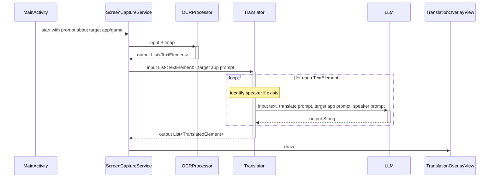

# LLM-powered Real-time Screen Translator
- This Android app translates text on screen in real-time and draws it as an overlay.

# TODO
## OCR
- [ ] Fine-tune foreground service
- [ ] Optimize screen capture interval
## Translation
- [ ] Feature to select source language and destination language
- [ ] Add support for Japanese
- [ ] Caching LLM translation response
- [X] Attach LLM API and translate
- [ ] Separate system prompt based on speaker
- [ ] LLM token monitoring debug view
- [ ] UI to input custom prompt about target app/game
- [ ] Enable Firebase App Check
## Overlay
- [ ] Adjust overlay text position
- [ ] Adjust overlay text style

# Architecture

